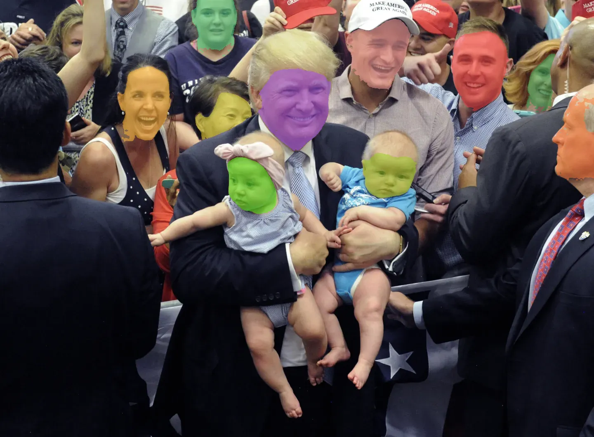

# prompt-blur-anything
A VLM-based tool to blur objects in images/videos, based on Florence-2 and SMA2.

- Prompt-based Object Detection using Florence-2
- Boxes from Florence-2 are processed by SAM2 for segmentation

## Examples:
### Blur babies in the picture
```python
python main.py --image_path images/test_images/test2.webp --pixelation_size 10  --prompt "baby"
```

<div style="display: flex; justify-content: space-between;">
    
    
    
</div>

### Blur all human faces in the picture
```python
<<<<<<< HEAD
python main.py --image_path test_images/test2.webp --pixelation_size 20  --prompt "human face"
```


<div style="display: flex; justify-content: space-between;">
    
    
    
</div>


